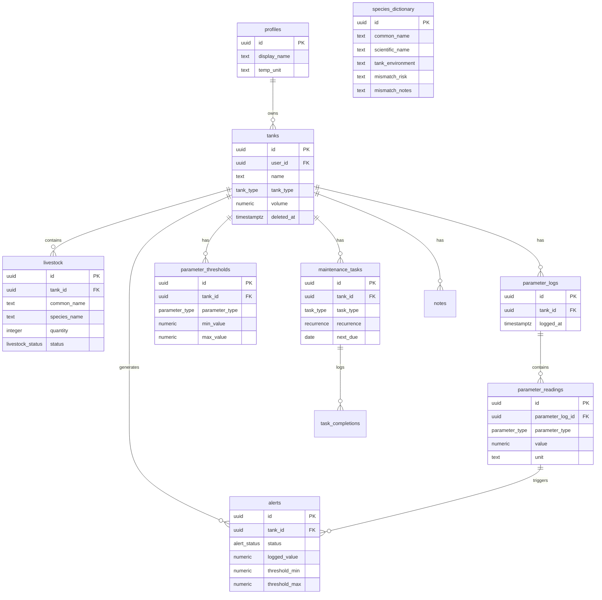

<div align="center">

# 🐠 Aquarist

**A professional aquarium management PWA for serious hobbyists.**

Track water parameters, manage livestock, schedule maintenance, and receive real-time biological threshold alerts — all in one elegantly designed app.

[](https://aquarist-web.vercel.app)
[](https://github.com/invidias-codem/Aquarist-web)

</div>

---

## ✨ Features

| Feature | Description |
|---|---|
| **Multi-Tank Dashboard** | Overview of all tanks with live livestock count and last telemetry log |
| **Water Parameter Logging** | Log pH, Ammonia, Nitrite, Nitrate, Temperature, Salinity, Alkalinity, Calcium, Magnesium, and Phosphate |
| **Biological Threshold Alerts** | Database-level triggers fire alerts the moment a reading breaches its safe range |
| **Telemetry Charts** | Recharts-powered visualizations of parameter history per tank |
| **Livestock Tracker** | Add, manage, and mark livestock with an autocomplete powered by a 182-species dictionary |
| **Mismatch Risk Warnings** | Species flagged as Medium/High/Critical risk surface inline warnings at add time |
| **Maintenance Scheduler** | Create recurring tasks (water changes, filter cleans, dosing) with auto-rescheduling on completion |
| **Species Dictionary** | 182 curated commercial species across freshwater, marine, and brackish categories |
| **PWA Ready** | Installable on mobile and desktop, works offline |
| **Auth + Security** | Email confirmation flow, Cloudflare Turnstile CAPTCHA, and custom lockout after 5 failed login attempts |

---

## 🏗️ Architecture

```
aquarist-web/
├── src/
│   ├── pages/
│   │   ├── Dashboard.tsx        # Tank overview with live data queries
│   │   ├── TankDetail.tsx       # Full tank management hub (livestock, telemetry, alerts, maintenance)
│   │   ├── TankForm.tsx         # Create / edit tank form
│   │   ├── Login.tsx            # Auth with lockout + Turnstile CAPTCHA
│   │   ├── Register.tsx         # Registration with email confirmation
│   │   └── AuthCallback.tsx     # Handles Supabase email confirmation redirect
│   ├── components/
│   │   ├── telemetry/
│   │   │   ├── ParameterLogger.tsx   # Multi-parameter log entry form
│   │   │   └── TelemetryCharts.tsx   # Recharts history visualizations
│   │   ├── maintenance/
│   │   │   └── MaintenanceScheduler.tsx  # Task CRUD + completion tracking
│   │   └── ui/                   # shadcn/ui component library
│   ├── contexts/
│   │   └── AuthContext.tsx       # Global session state via Supabase auth listener
│   └── lib/
│       └── supabase.ts           # Supabase client (reads from import.meta.env)
├── supabase/
│   └── migrations/
│       ├── 20260705000000_initial_schema.sql      # All tables, RLS policies, triggers
│       ├── 20260705000001_auth_lockout.sql        # Custom lockout RPCs
│       ├── 20260705000002_api_grants.sql          # Role grants for anon/authenticated
│       ├── 20260705000003_telemetry_triggers.sql  # Tank creation thresholds + alert trigger
│       ├── 20260705000004_species_and_maintenance.sql  # Species table + task completion trigger
│       └── seed_data.sql                          # 182-species dictionary seed
├── vercel.json                   # SPA rewrite rule for client-side routing
└── vite.config.ts
```

---

## 🛠️ Tech Stack

### Frontend
| Layer | Technology |
|---|---|
| Framework | React 18 + TypeScript |
| Build Tool | Vite |
| Styling | Vanilla CSS + Tailwind CSS v4 |
| UI Components | shadcn/ui (Radix UI primitives) |
| Charts | Recharts |
| Routing | React Router v6 |
| Notifications | Sonner |
| CAPTCHA | Cloudflare Turnstile (`@marsidev/react-turnstile`) |

### Backend (Supabase Cloud)
| Layer | Technology |
|---|---|
| Database | PostgreSQL 15 (Supabase managed) |
| Auth | Supabase Auth (email/password + email confirmation) |
| API | Supabase PostgREST (auto-generated REST from schema) |
| Real-time | Supabase Realtime |
| Row Security | Row Level Security (RLS) on all tables |
| Triggers | PostgreSQL triggers for threshold seeding, alert detection, task rescheduling, and profile auto-creation |

### Deployment
| Layer | Platform |
|---|---|
| Frontend | Vercel (auto-deploys from `main` branch) |
| Backend | Supabase Cloud (`xnuqgwhwqitkeonmlseu`) |

---

## 🗄️ Database Schema



---

## ⚡ Automated Database Logic

All business logic lives at the database level for reliability:

| Trigger | Event | Action |
|---|---|---|
| `on_auth_user_created` | New user signs up | Auto-creates a `profiles` row |
| `on_tank_created` | New tank inserted | Seeds 5–9 biological `parameter_thresholds` based on `tank_type` |
| `on_parameter_logged` | New `parameter_readings` row | Evaluates value against thresholds; inserts `alerts` if breached |
| `on_task_completed` | New `task_completions` row | Recalculates `next_due` date on the parent `maintenance_tasks` row |
| `set_updated_at` | Any UPDATE on tracked tables | Stamps the `updated_at` column automatically |

### Default Thresholds by Tank Type

| Parameter | Freshwater | Marine | Brackish |
|---|---|---|---|
| pH | 6.5 – 7.5 | 8.1 – 8.4 | 7.5 – 8.4 |
| Ammonia | 0.0 – 0.25 ppm | 0.0 – 0.1 ppm | 0.0 – 0.1 ppm |
| Nitrite | 0.0 – 0.0 ppm | 0.0 – 0.0 ppm | 0.0 – 0.0 ppm |
| Nitrate | 0.0 – 40.0 ppm | 0.0 – 10.0 ppm | 0.0 – 20.0 ppm |
| Temperature | 74 – 80 °F | 75 – 80 °F | 75 – 80 °F |
| Salinity | — | 1.023 – 1.026 sg | 1.005 – 1.015 sg |
| Alkalinity | — | 8.0 – 12.0 dKH | — |
| Calcium | — | 380 – 450 ppm | — |
| Magnesium | — | 1250 – 1350 ppm | — |

---

## 🎨 Design System

The app uses a **"Gothic Chrome"** design language:

- **Color Palette:** `zinc-950` base, deep charcoal surfaces, neon accent highlights
- **Typography:** System font stack with tight tracking for headers
- **Mode:** Dark-first — no light mode toggle
- **Effects:** Glassmorphism cards, metallic gradient modals, subtle micro-animations
- **Components:** Built on shadcn/ui (Radix UI) with custom CSS overrides to match the theme

---

## 🚀 Local Development

### Prerequisites
- Node.js 18+
- Supabase CLI

### Setup

```bash
# 1. Clone the repository
git clone https://github.com/invidias-codem/Aquarist-web.git
cd Aquarist-web

# 2. Install dependencies
npm install

# 3. Copy the environment template and fill in your Supabase keys
cp .env.example .env

# 4. Start the local Supabase stack
npx supabase start

# 5. Push the schema to your local database
npx supabase db push

# 6. Seed the species dictionary
node scripts/seed_species.cjs

# 7. Start the dev server
npm run dev
```

### Environment Variables

```env
VITE_SUPABASE_URL=https://<your-project-ref>.supabase.co
VITE_SUPABASE_ANON_KEY=<your-anon-key>
```

> ⚠️ Never commit your `.env` file or `service_role` key. The `.gitignore` excludes `.env` by default.

---

## 📦 Deployment

The app auto-deploys to Vercel on every push to `main`.

**To deploy from scratch:**

1. Push the repo to GitHub
2. Import into [Vercel](https://vercel.com/new) and add `VITE_SUPABASE_URL` + `VITE_SUPABASE_ANON_KEY` as environment variables
3. Link the Supabase project and push the schema: `npx supabase db push`
4. Whitelist your Vercel domain in **Supabase → Auth → URL Configuration → Redirect URLs**

---

## 📄 License

Private project. All rights reserved.
